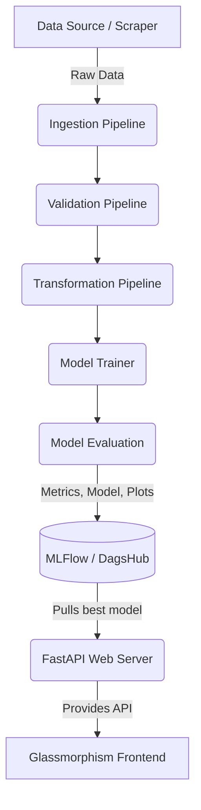

# 🎓 JOSAA Rank Predictor

<div align="center">
  
  
  
  
  
  
</div>

<br>

An Advanced End-to-End MLOps Pipeline & Web Application designed to accurately forecast JOSAA (Joint Seat Allocation Authority) seat allotments. It leverages historical opening and closing rank data to predict college availability and check real-time cutoffs.

---

## ✨ Features

### 🖥️ Modern Web Interface (Glassmorphism)
- **Rank Recommendations:** Enter your rank, category, gender, and quota to get dynamically classified college predictions (Safe, Borderline, or Low Chance).
- **Cutoff Checker:** Dynamically query and filter opening/closing ranks by specific Institute and Branch.
- **Generate Predictions:** Trigger a visual, step-by-step pipeline execution for predicting cutoffs for future years across thousands of candidates.
- **Admin Panel (Secure):** Secured by a passkey logic. Allows the administrator to instantly trigger a complete retraining pipeline from the UI.

### 🧠 End-to-End MLOps Architecture
- **Data Ingestion & web-scraping:** Automatically acquires official cutoff datasets.
- **Data Validation & Transformation:** Pre-processes, cleans, and encodes features utilizing pipelines and stores artifacts securely.
- **Model Training:** Employs advanced regressors (Gradient Boosting etc.) hooked up for hyperparameter tracking.
- **Model Evaluation:** Tracks MSE, R2 Score, RMSE, and saves residual plots.
- **MLFlow & DagsHub Integration:** Fully tracks experiments, parameters, and artifact versions centrally in Dagshub. Model versions are aliased dynamically (`models:/latest`) to resolve automatically on server spins.

---

## 🛠️ Project Architecture



---

## 🚀 Quick Setup & Installation

### 1. Clone the repository
```bash
git clone https://github.com/VashuTheGreat/JOSAA_RANK_PREDICTOR.git
cd JOSAA_RANK_PREDICTOR
```

### 2. Set up the Environment
Use [uv](https://github.com/astral-sh/uv) (or pip/poetry) to install dependencies:
```bash
uv sync  # Install environment and dependencies
```

### 3. Environment Variables
Create a `.env` file in the root directory. You will need your DagsHub MLflow tracking URI, username, and token:
```env
MLFLOW_TRACKING_URI="https://dagshub.com/<YOUR_WORKSPACE>/<REPO>.mlflow"
MLFLOW_TRACKING_USERNAME="<Username>"
MLFLOW_TRACKING_PASSWORD="<Token>"

MLFLOW_MODEL_URI="models:/JOSAA/latest"
MLFLOW_MODEL_OBJECT_URI="models:/JOSAA_OBJECT/latest"
```

### 4. Run the Engine
Start up the FastAPI backend and Jinja2 frontend:
```bash
uv run main.py
```
*The web application will be live at `http://127.0.0.1:8000`.*

---

## 🛣️ API Endpoints Reference

The backend exposes several powerful endpoints used by the dashboard UI:

- `GET /` — Serves the frontend application.
- `GET /api/available_data/available_data` — Returns uniquely grouped data arrays (e.g. Institutes, Quotas, Rounds) for frontend dropdowns.
- `GET /api/available_data/institute_branches` — Maps each individual Institute to its exact available branches dynamically.
- `POST /api/cuttOff/rank_based_recommend` — Accepts rank/category data and yields evaluated chances for institutions.
- `POST /api/cuttOff/cutOffcheck` — Searches the datasets for specific cutoffs.
- `POST /api/fit_on_year/fit_on_year` — Pre-processes parameters tailored to a specific upcoming year for modeling predictions.
- `GET /api/retrain_model/retrain` — **[Admin]** Wipes current context, triggers pipeline sequence (Ingestion ➔ Eval), unloads old models, and spins up the newly cached `.pkl` objects from DagsHub.

---

## 🛡️ Security

The **Generate Predictions** and **Admin** tabs on the Frontend are locked behind an admin passkey overlay (`alookhalo`) to strictly prevent unauthorized users from heavily utilizing server-side batch prediction or kicking off deep training pipelines.

---

<div align="center">
  <b>Built with ❤️ by VashuTheGreat</b>
</div>
